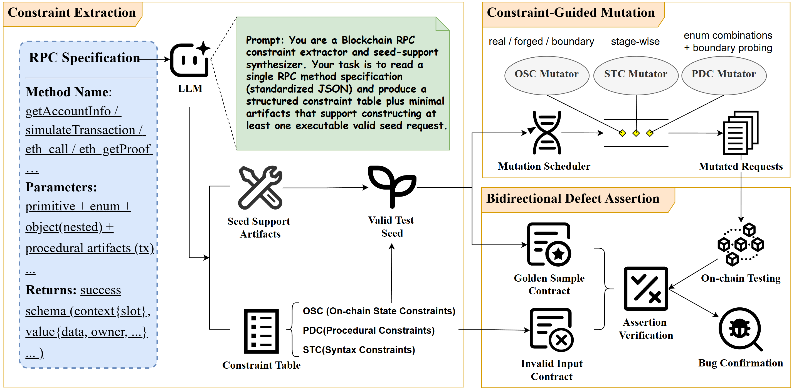

# RPCSpecter

RPCSpecter is a **specification-driven, constraint-aware fuzzing framework** for detecting bugs in blockchain RPC implementations.

It takes standardized RPC specifications as input, extracts semantic constraints from those specifications, generates executable seed requests, mutates the requests with constraint guidance, and checks responses with a bidirectional assertion oracle.

## Overview



## Key Ideas

RPCSpecter uses three constraint categories to model RPC parameter validity:

- **OSC: On-chain State Constraints**
  Values that depend on current or historical blockchain state, such as an existing account, latest slot, fresh blockhash, available block range, or pruned boundary.

- **PDC: Procedural Constraints**
  Values that must be produced by a construction pipeline, such as building, signing, serializing, and encoding a transaction.

- **STC: Syntax Constraints**
  Syntactic, combinational, and boundary constraints, including enumerated options, cross-parameter compatibility, numeric ranges, string sizes, and array lengths.

The mutation engine implements these as:

```text
ConstraintDrivenMutation/mutators/osc_mutator.py   # OSC
ConstraintDrivenMutation/mutators/pdc_mutator.py   # PDC
ConstraintDrivenMutation/mutators/stc_mutator.py   # STC
```

## Repository Structure

```text
RPCSpecter/
├── RPC_Specification/              # Ethereum and Solana RPC specifications
├── ConstraintExtraction/           # LLM-based constraint extraction and helper synthesis
│   ├── prompts/                    # extraction and helper-generation prompts
│   └── assertions/                 # generated negative rules and golden samples
├── ConstraintDrivenMutation/       # OSC/PDC/STC-aware mutation engine
│   └── mutators/
│       ├── osc_mutator.py
│       ├── pdc_mutator.py
│       ├── stc_mutator.py
│       └── common.py
├── BidirectionalDefectAssertion/   # negative-rule and golden-sample assertion engine
├── config.py                       # shared runtime/path configuration
├── pipeline.py                     # end-to-end fuzzing pipeline
└── requirements.txt
```

## Installation

### Prerequisites

- Python 3.11+
- A local Ethereum or Solana development node
- An OpenAI-compatible API key for constraint extraction and helper synthesis

### Setup

```bash
cd RPCSpecter
python -m venv venv
source venv/bin/activate
pip install -r requirements.txt

export OPENAI_API_KEY="sk-xxx"
export base_url="https://your-openai-compatible-endpoint/v1"
```

Configure one target chain:

```bash
export CHAIN="ethereum"
export ETH_RPC="http://127.0.0.1:8545"
```

or:

```bash
export CHAIN="solana"
export SOLANA_RPC="http://127.0.0.1:8899"
```

Optional runtime knobs:

```bash
export RPC_TIMEOUT=3
export MUTATION_COUNT=500
export OPENAI_MODEL="gpt-5.1"
```

## Quick Start

```bash
# 1. Extract constraints and negative rules
python3 ConstraintExtraction/llm.py --chain "$CHAIN"

# 2. Generate seed-support helper artifacts
python3 ConstraintExtraction/seed_generate.py --chain "$CHAIN"

# 3. Run end-to-end fuzzing
python3 pipeline.py --chain "$CHAIN" --count 500
```

Run a single method:

```bash
python3 pipeline.py --chain ethereum --method eth_call --count 20
python3 pipeline.py --chain solana --method getAccountInfo --count 20
```

Generate mutants without sending requests:

```bash
python3 ConstraintDrivenMutation/mutator_engine.py \
  --chain ethereum \
  --method eth_call \
  --num 10 \
  --out mutants.jsonl
```

## Outputs

For each tested method, RPCSpecter writes:

```text
results/{chain}/{method}/mutations.jsonl       # generated requests
results/{chain}/{method}/results.jsonl         # requests, responses, verdicts
results/{chain}/{method}/report_summary.json   # summary statistics
```

Typical verdicts:

| Verdict | Meaning |
|---|---|
| `PASS` | Valid request response matches the learned golden contract. |
| `GOLDEN_CREATED` | First successful response shape observed and stored as a golden sample. |
| `GOLDEN_UPDATED` | Golden sample expanded after repeated bound exceedances. |
| `NEG_PASS` | Invalid request was correctly rejected. |
| `NEG_VIOLATION` | Invalid request was accepted; potential bug or semantic inconsistency. |
| `FAILED` | Valid request response deviated from the golden contract. |

